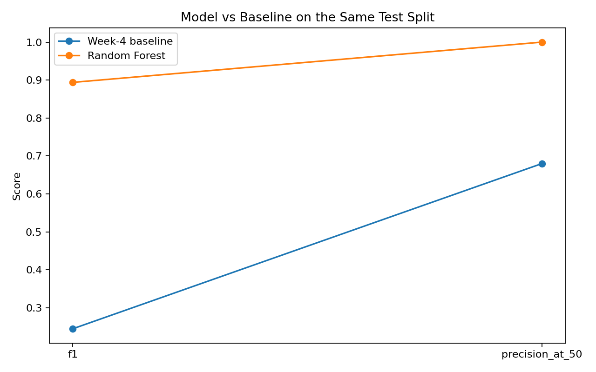
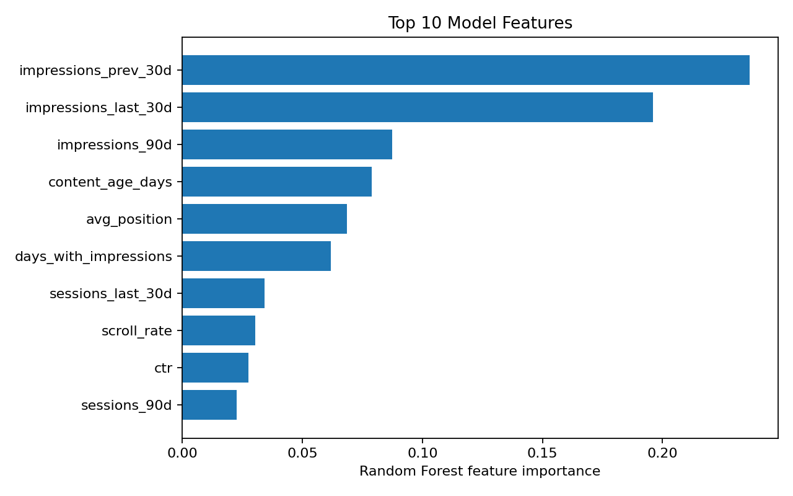

# Content Refresh Opportunity Scoring

## Google Search Ranking & Discoverability Capstone

**Author:** Diya Rana  
**Lane:** Refresh / Content Opportunity Scoring  
**Date:** September 2026

---

## Abstract

This project investigates whether machine learning can help prioritize content pages that show signs of declining search performance and may deserve review. Using the FlyRank ML Internship dataset, the task was framed as an observed current-window classification problem where pages marked as declining were treated as the target class. A Random Forest classifier was trained using content, search, performance, engagement, freshness, and trend-related features and evaluated using a client-grouped train/test split to reduce client-level leakage. The model achieved **87.8% accuracy, 83.9% precision, 95.7% recall, 89.4% F1, and 96.8% ROC-AUC**, while achieving **100% Precision@50** on the test set. These results indicate that the model can provide a useful prioritization signal, although the target represents an observed current-window outcome rather than a future prediction or proof that refreshing a page will cause ranking improvement.

---

## 1. Introduction

### Problem Statement

Content teams may have thousands of pages that could potentially benefit from review or updating. Manually evaluating every page is inefficient, so a data-driven scoring system can help prioritize pages for further investigation.

The objective of this project is:

> **Can machine learning identify and prioritize pages that show signals associated with declining search performance?**

The focus is not to claim that the model proves Google's ranking algorithm or that refreshing a page will causally improve its performance. Instead, the model is designed as a **decision-support and prioritization system**.

---

## 2. Data

The project uses the anonymized FlyRank ML Internship dataset.

| Property | Value |
|---|---:|
| Rows | 30,000 |
| Unique pages | 30,000 |
| Clients | 32 |
| Columns | 44 |

The dataset contains information related to:

- Search volume
- Competition
- CPC
- Content type and intent
- Word and character counts
- Search impressions
- Clicks
- Sessions
- Pageviews
- Engagement
- AI traffic
- Content age
- Freshness
- Average search position
- CTR
- Trend indicators

The target was defined as:

- `1 = declining`
- `0 = not declining`

where the declining class was derived from the observed `trend_direction` field.

### Important framing

The target is an **observed current-window proxy**. It should not be interpreted as a clean future-window prediction target.

---

## 3. Methodology

### 3.1 Target

The classification target was created as:

80   ```python
81   y = (df["trend_direction"] == "down").astype(int)
82   ```

### 3.2 Features

The model used numeric and derived content-performance features while excluding identifiers and direct target fields.

The following were excluded:

trend_direction
trend_pct
is_declining_label
content_id
client_id

A leakage audit was also performed to check for suspicious target-related feature names.

### 3.3 Baseline

A simple rule-based baseline was implemented using content freshness, visibility, impressions, and search position.

The baseline increased a page's priority score when:

days_since_last_update >= 180
days_since_last_update >= 365
impressions_90d >= 500
impressions_90d >= 5000
avg_position > 10

Pages with a score of at least 4 were classified as:

REVIEW_REFRESH

Otherwise:

MONITOR

### 3.4 Machine Learning Model

A Random Forest classifier was selected using:

200 trees
Random state = 42
Balanced class weights
Parallel processing with n_jobs=-1
### 3.5 Validation Strategy

A client-grouped train/test split was used.

Training rows: 18,690
Test rows: 11,310
Training clients: 21
Test clients: 11
Client overlap: 0

The declining rate was similar across the two splits:

Training: 54.6%
Test: 53.6%

Grouping by client provides a stronger test of whether the model can generalize beyond the clients used for training.

## 4. Results
### 4.1 Model Performance

<table>
<thead>
<tr>
<th>Metric</th>
<th>Random Forest</th>
</tr>
</thead>
<tbody>
<tr><td>Accuracy</td><td>0.878</td></tr>
<tr><td>Precision</td><td>0.839</td></tr>
<tr><td>Recall</td><td>0.957</td></tr>
<tr><td>F1</td><td>0.894</td></tr>
<tr><td>ROC-AUC</td><td>0.968</td></tr>
<tr><td>Average Precision</td><td>0.973</td></tr>
<tr><td>Precision@50</td><td>1.000</td></tr>
</tbody>
</table>

The high recall indicates that the model identified most of the pages belonging to the declining class in the test set.

The **Precision@50 of 1.000** is particularly useful for prioritization because all of the top 50 ranked test pages were labeled as declining under the evaluation target.

---

### 4.2 Baseline Comparison

<table>
<thead>
<tr>
<th>Metric</th>
<th>Week-4 Baseline</th>
<th>Random Forest</th>
</tr>
</thead>
<tbody>
<tr><td>Accuracy</td><td>0.479</td><td><strong>0.878</strong></td></tr>
<tr><td>Precision</td><td>0.549</td><td><strong>0.839</strong></td></tr>
<tr><td>Recall</td><td>0.157</td><td><strong>0.957</strong></td></tr>
<tr><td>F1</td><td>0.245</td><td><strong>0.894</strong></td></tr>
<tr><td>Precision@50</td><td>0.680</td><td><strong>1.000</strong></td></tr>
</tbody>
</table>

The Random Forest substantially outperformed the rule-based baseline across all reported metrics.

<p align="center">

</p>

---

### 4.3 Feature Importance

Feature importance was examined to understand which signals contributed most strongly to the Random Forest's decisions.

<p align="center">

</p>

Feature importance should be interpreted as a model diagnostic rather than evidence of causality.

---

### 4.4 Confusion Matrix

The evaluation also included a confusion matrix to examine the model's classification behavior across the declining and non-declining classes.

The confusion matrix is available in the capstone notebook:

`work/notebooks/capstone.ipynb`

---

## 5. Action Prioritization

The final workflow converts model scores and content signals into an actionable review queue.

Pages are categorized using signals such as:

Staleness
Search visibility
Impressions
Model priority score

The queue distinguishes pages such as:

STALE_VISIBLE
STALE
VISIBLE
OTHER

High-priority pages are assigned:

REVIEW_REFRESH

Lower-priority pages are assigned:

MONITOR

The confidence note associated with the baseline score is:

Score ≥ 6: Multiple strong priority signals
Score ≥ 4: Meets baseline review threshold
Otherwise: Lower priority based on baseline

The resulting queue can help content teams focus investigation on a smaller set of pages instead of manually reviewing the entire dataset.

## 6. Limitations

This project has several important limitations.

Current-window target

The target is based on an observed current-window trend indicator. Therefore, the model should not be described as predicting future decline.

No causal claims

The model does not establish that refreshing content will improve rankings, traffic, or conversions.

Dataset scope

The dataset is anonymized and represents a particular internship dataset. Results may not generalize to every website, industry, or search environment.

Model interpretability

Random Forest feature importance identifies useful predictive signals but does not establish why those signals matter or prove causal relationships.

Search ranking complexity

Search performance depends on many external factors that are not necessarily represented in the dataset.

Evaluation limitations

The model and baseline were evaluated on a single client-grouped train/test split. Additional validation across multiple grouped splits and future time windows would provide stronger evidence of robustness.


### 7. Ranked Recommendations
1. Prioritize high-confidence pages

Start with pages receiving strong model scores, especially those near the top of the ranking queue.

2. Combine model scores with business signals

Use model output together with impressions, visibility, freshness, and content context before making an actual refresh decision.

3. Review stale but visible content

Pages that are both old and receiving meaningful impressions may represent useful opportunities for human review.

4. Keep human review in the loop

The model should recommend which pages deserve attention rather than automatically rewriting or publishing content.

5. Monitor outcomes

Future iterations should evaluate whether prioritized pages actually improve after controlled refresh experiments.

### 8. Reproducibility

The project repository contains the notebooks, report, figures, and public-safe output artifacts used in this analysis.

Main notebook

work/notebooks/capstone.ipynb

Supporting notebooks
work/notebooks/w01_research_question.ipynb
work/notebooks/w02_ml_task_framing.ipynb
work/notebooks/w03_data_contract.ipynb
work/notebooks/w03_feature_leakage_check.ipynb
work/notebooks/w04_baseline_score.ipynb
work/notebooks/w04_signal_audit.ipynb
work/notebooks/w05_model.ipynb
work/notebooks/w06_validation_audit.ipynb
work/notebooks/w07_action_playbook.ipynb
##Public-safe artifacts
work/outputs/capstone_metrics.json
work/outputs/capstone_action_summary.csv
work/figures/capstone_model_vs_baseline.png
work/figures/capstone_feature_importance.png

The analysis uses a fixed random seed and client-grouped validation split to make the evaluation reproducible.

No client names, domains, URLs, private search queries, credentials, or raw private exports are included in the public-facing analysis.

## Acknowledgments & Data Credit

Built on the FlyRank ML Internship dataset

FlyRank: https://flyrank.ai

## Conclusion

This project demonstrates a practical machine-learning approach for prioritizing content refresh opportunities. The Random Forest model substantially outperformed the rule-based baseline and achieved strong ranking-oriented performance, including 100% Precision@50 on the test set.

The results support using machine learning as a prioritization layer for content operations, while maintaining an important distinction between identifying observed decline signals and predicting future performance or proving causal impact.

The recommended workflow is model-assisted prioritization followed by human review and measurement, rather than fully automated content decisions.

